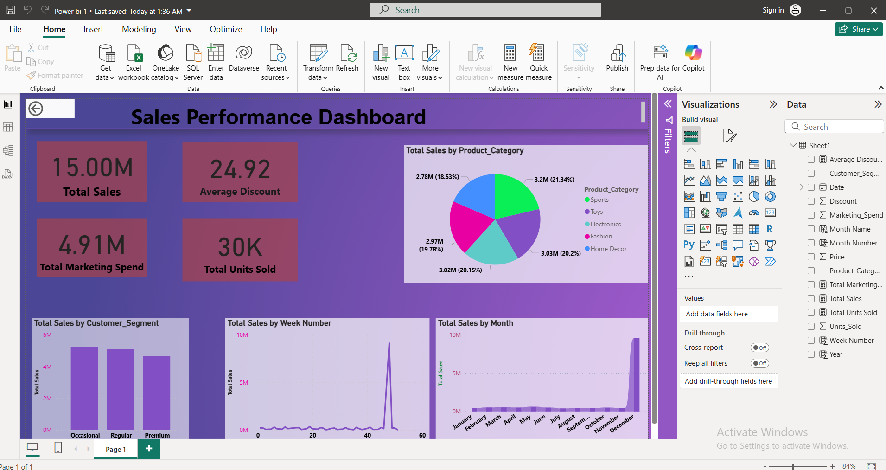

✨📊🚀 FUTURE_DS_TASK1: Business Sales Dashboard from E-commerce Data 🚀📊✨

-----------

🌟💡📈 PROJECT OVERVIEW 📊💰🛍️

This repository contains the awesome deliverables for Task 1: Business Sales Dashboard from E-commerce Data, a super exciting part of my Future Interns Data Science & Analytics internship program! 🎉🥳 The main goal of this task was to dive deep into e-commerce sales data to unearth key business insights, like figuring out the best-selling products, spotting cool sales trends and identifying high-revenue categories. 🕵️‍♀️🎯

🎯🔍🛍️ TASK OBJECTIVE  💡📈📊

Analyze e-commerce data to identify best-selling products, sales trends and high-revenue categories using Power BI. It's all about making smart business decisions! 🧠✨

💪🛠️📊 SKILLS DEMONSTRATED 🚀✨🧠

=> Data Cleaning: Prepping and transforming raw sales data to make it sparkling clean! 🧹💧

=> DAX (Data Analysis Expressions): Crafting custom measures and calculated columns in Power BI for super powerful analysis! ➕➖🔢

=> Trend Analysis: Uncovering hidden sales patterns and changes over time (week by week, month by month, year by year!). 📈📉📊

=> Business Storytelling: Transforming complex data into clear, compelling, and actionable stories through amazing interactive visualizations! 🗣️📖✨

💻🖥️📊 TOOLS USED 🚀✨

** Microsoft Excel: For initial data peeking and getting things ready. 📝📊

** Microsoft Power BI Desktop: The ultimate tool for data modeling, creating stunning visualizations and building that fantastic dashboard! 🌟💡

📁📂📊 PROJECT FILES 📋📈

 `Business_Sales_Dashboard.pbix`: This is the Power BI Desktop file holding all the magic –  data model, reports, and the interactive dashboard! 📁✨

 `Ecommerce Sales Prediction_Data.xlsx`: The raw e-commerce sales dataset that fueled all this awesome analysis! 📊📈 

📸✨ INTERACTIVE DASHBOARD PREVIEW 🤩📊

Here are a few glimpses of the interactive dashboard, showcasing key insights and design elements! 👀🖼️

_A general overview of the sales performance dashboard. 📊✨_

_Detailing sales performance across different customer segments. 📊👥_

_Illustrating the distribution of sales by product category. 🥧🛍️_

▶️✨ DASHBOARD WALKTHROUGH VIDEO 📹📊

Want to see the dashboard in action? Click the link below for a full interactive walkthrough! You'll see how filters work and how insights come alive. 🚀🎥

[Click here to watch the full video walkthrough on YouTube!](https://youtu.be/mJiij0E_qoY?si=gdsBCJEto3Wy7UDp)

🌟💡📈 KEY INSIGHTS FROM THE DASHBOARD 📊💰🎯

1. Top-Performing Product Categories: Electronics and Fashion consistently shone as the absolute champions, raking in the highest revenue and showing incredible market demand! 🏆👗⚡

2. Sales Trends by Month/Week: Deep dive into sales over time revealed A significant peak in sales during Q4 (October-December) driven by holiday shopping and a dip in Q1. 🎄🗓️📈

3. Customer Segment Performance: Premium customers contributed disproportionately to total sales, highlighting their immense value, while Occasional customers showed promising potential for growth through smart, targeted campaigns. 👑🤝💖

4. Discount Impact: While discounts definitely boosted sales volumes, we need to fine-tune the average discount percentage to make sure profitability stays high, especially for those high-margin products. 💸💲💡

5. Marketing Spend Effectiveness: Marketing spend showed a fantastic positive correlation with total sales, which means those campaigns were hitting their mark! Though, ROI did show some fun variations across different periods. 🎯📊💰

📖🖥️✨ HOW TO VIEW THE DASHBOARD 🚀⬇️

1.  Simply download the `Business_Sales_Dashboard.pbix` file from this amazing repository. ⬇️📥

2.  Open the file effortlessly using Power BI Desktop on your computer. 🖥️✨

3.  Get ready to interact with all the cool charts and filters to explore the data and uncover even more insights! 🖱️🔍🤩

---------

Gemachis Tesfaye [https://github.com/urjiiko1] 🌟

Date of Completion : July 7, 2025 🗓️✅
